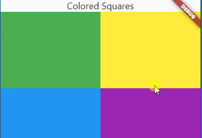
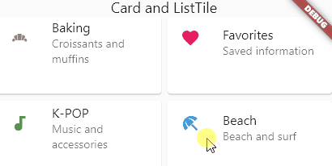
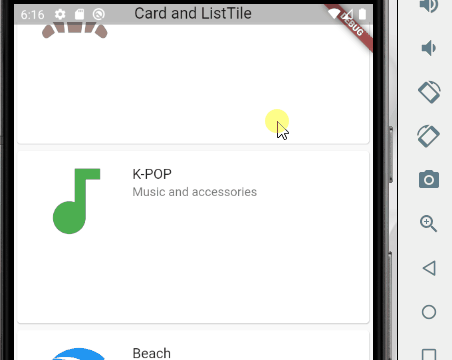
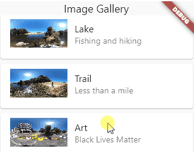

# squares

Flutter GridView exercises.

[Documentation](https://api.flutter.dev/flutter/widgets/GridView-class.html)

## 1 - Master Branch

* review information on [Flutter Flex structures](https://youtu.be/CI7x0mAZiY0)
* wrap GridView.count in a Flexible widget
  * The GridView is in a Column to handle the top Text Row

* containers

## 2 - Tiles

* review information on [ListTile](https://youtu.be/l8dj0yPBvgQ)

## 3 - Links

* use Flutter [url_launcher](https://pub.dev/packages/url_launcher)
* the link will open in a new browser window

## 4 - Images

